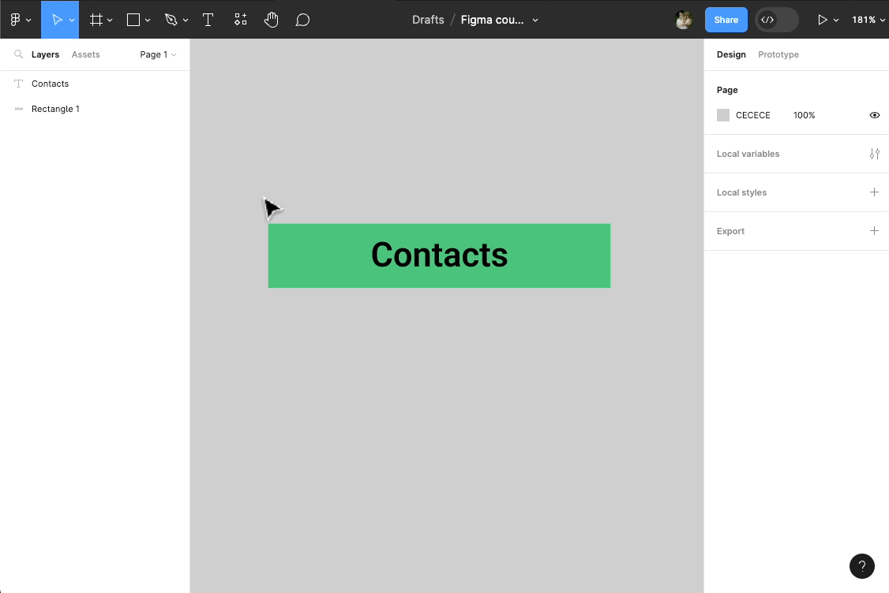

# Groupes

Afin de créer des éléments d'interface plus complexe il est possible de grouper des élements. 

Pour l'exemple nous allons créer une barre de statut (que l'on peut retrouver sur beaucoup d'appli mobiles).

Pour celà, commencez par positionner le texte au milieu du rectangle.

::: tip Superposition des calques
> **Attention :** Comme le rectangle a été créé en dernier, il apparait au dessus du texte dans le **panneau des calques** à gauche. Il faut donc changer l'ordre de superposition des calques.

Plusieurs façons de faire :
- Clique droit sur le texte, puis sélectionnez l'option _Bring to front_
- Clique droit le rectangle et, clique droit puis sélectionnez l'option _Send to back_

- Dans le **panneau des calques** à gauche, faites glisser le texte au dessus du rectangle ou bien l'inverse.

:::

::: tip Positionnement
Pour centrer des éléments les uns par rapport aux autres, il existe plusieurs solutions :
- Sélectionnez tous les éléments (avec <kbd>Shift</kbd> OU en trançant un rectangle autour avec l'outil de sélection ) puis utilisez les boutons d'alignement dans le **design panel** à gauche en haut 

- Sélectionnez directement le texte au centre du rectangle avec les aides visuels de Figma

:::

Une fois positionnés, sélectionnez le texte et le rectangle (par exemple avec <kbd>Shift</kbd>) puis faites <kbd>Ctrl</kbd> + <kbd>G</kbd> pour grouper.

> **Remarque :** Vous pouvez voir qu'un nouvel élément (calque de type groupe) est apparu dans le **layers panel** à gauche. Il contient le texte et le rectangle.

Veuillez renommer les calques pour une meilleure organisation de votre design.

Vous disposez maintenant d'un élément **Status bar**** (bare de statut) utilisable dans vos futurs écrans ! 👏